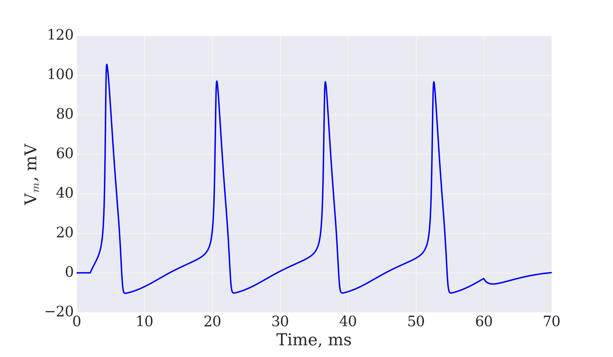
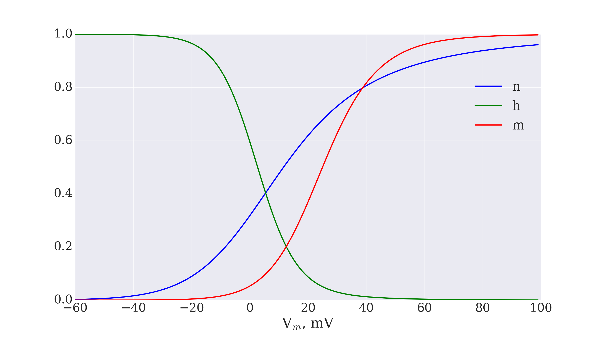

# Hodgkin&Huxley model

Mathematical model that describes how action potentials in neurons are initiated and propagated. (Wiki)

Action Potential:

Gating variables (n,h,m):

References:
1. https://www.ncbi.nlm.nih.gov/pmc/articles/PMC1392413/pdf/jphysiol01442-0106.pdf
